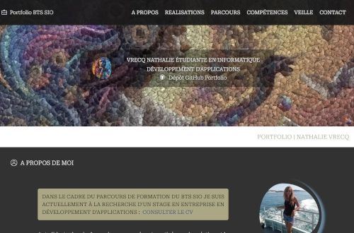

# Portfolio BTS SIO

[portfolio-nathalie-vrecq.codevea.com](https://www.portfolio-nathalie-vrecq.codevea.com/)

  

Création d'un portfolio dans la cadre des études du ***BTS SIO Option SLAM*** : Services Informatiques aux Organisations, option Solutions Logicielles et Applications Métiers.





## Versions :

|                |*Description*|*Tehcnologies*|
|----------------|----------------|----------------|
|Version : 1|`One-page statique`|Html, SASS/CSS, PHP - JavaScript|
|Version : 2|`Application Symfony 7.2`||

### Bundle :

* Gestion des images
    * VichUploaderBundle
    * LiipImagineBundle
* Administration
    *  EasyAdminBundle


### Informations sur l'installation :

* Modifiez les informations du fichier .env en entrant vos paramètres personnels.
* Modifiez l'adresse email d'envoi dans le fichier ResetPasswordController.php (ligne 160, dans le namespace App\Controller).
* Problèmes liés aux jetons CSRF invalides (Symfony 7.2) : Si vous rencontrez un problème de jeton CSRF invalide, recompilez les assets avec la commande suivante :

```bash
php bin/console asset-map:compile
```


## Licence
Ce projet est sous licence personnalisée. Voir le fichier [LICENSE](LICENSE) pour plus d'informations.

* Droits d'utilisation

    * Vous êtes autorisé(e) à utiliser le code de l'application pour concevoir votre propre portfolio. Toutefois, les images et photos ne doivent pas être utilisées, partagées ou diffusées sans mon accord préalable, et doivent être remplacées. Je vous serais également reconnaissante  :heart:  si vous acceptiez de conserver ou d'inclure un lien dans le pied de page pointant vers le dépôt GitHub original. :heart_eyes:
